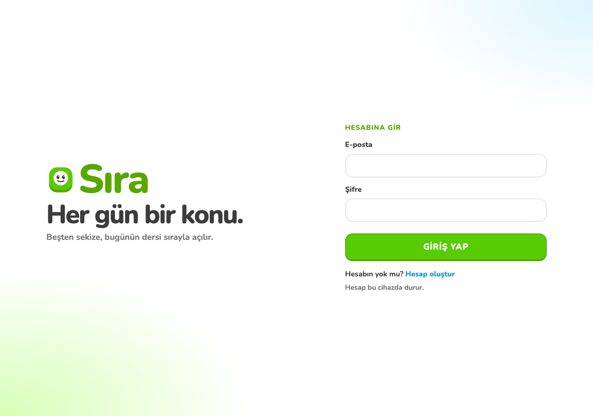

# Sıra

Ortaokul için günlük ders. Beş, altı, yedi ve sekizinci sınıf her gün bir konuyu sırayla açar. Hesap e-posta ile kurulur; ilk girişte avatar kaydedilince ders başlar.

A daily lesson for middle school. Grades 5 through 8 open one topic each day, in order. An account is created with an email address, and the lesson starts after the first avatar is saved.




Canlı site / Live site: https://sira-gunluk.furkanturkkan25.workers.dev/

## Kurulum / Setup

```bash
cd ortaokul-gunluk
npm install
npm run dev
```

Geliştirme adresi Vite’ın yazdığı yerel porttur, çoğu zaman http://127.0.0.1:5173

The dev server uses the local port Vite prints, usually http://127.0.0.1:5173

Üretim derlemesi ve Worker yayını / Production build and Worker deploy:

```bash
npm run build
npx wrangler deploy
```

## Teknoloji / Stack

Arayüz **React 19** ve **Vite 6** ile yazılıyor. Ders, puan, seri ve profil istemcide tutulup sunucuyla birleşiyor. Sunucu bir **Cloudflare Worker**. Ortak oda bir **Durable Object** (`SiraStore`) ve içinde **SQLite**. Eski **KV** alanı yalnızca ilk tohum için duruyor. Statik dosyalar `dist` klasöründen gelir; `/api/*` önce Worker’a düşer. Hesaplar e-posta ile açılır. Eski isimle açılmış hesaplar kendi adlarıyla girmeye devam eder. Şifre düz metin olarak saklanmaz.

The interface is **React 19** and **Vite 6**. Lessons, points, streaks, and profiles live on the client and merge with the server. The server is a **Cloudflare Worker**. The shared room is a **Durable Object** (`SiraStore`) with **SQLite** inside. The older **KV** namespace is only the first seed. Static files come from `dist`, and `/api/*` hits the Worker first. Accounts open with an email address. Older name-based accounts still sign in with that name. Passwords are not stored as plain text.
